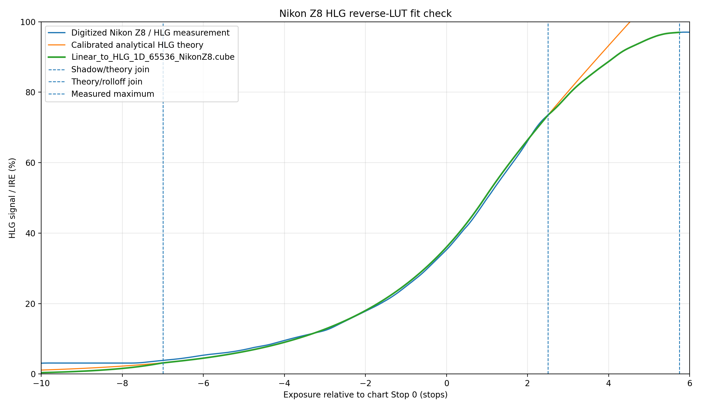

# Resolve Linear Flat-Field LUTs

语言：简体中文 | [English](README.md)

一套面向 DaVinci Resolve 的高精度 PQ/HLG 与线性光互转 1D LUT，用于视频及延时摄影中的线性平场除尘工作流。

## 适用范围

每个 LUT 都对 R、G、B 三个通道分别执行相同的一维传递函数。交付表的三列数值完全相同且单调，不进行通道混合。

这些 LUT 只执行文件所注明的传递函数变换：

- PQ/ST 2084 码值 ↔ 归一化线性光；
- 标准 HLG 信号 ↔ 相对场景线性光；或
- 本仓库的 Nikon Z8 HLG 模型 ↔ 与其配套的线性表示。

这些 LUT **不执行** 色域转换、RGB 矩阵、白点转换、色调映射、显示变换、HLG 系统伽马/OOTF、白平衡、曝光补偿、亮度计算或创意调色。

本项目面向 DaVinci Resolve 中 **不启用 Resolve Color Management（RCM）** 的显式节点工作流。它不是通用创意 LUT，也不是将相机素材直接变为最终显示画面的 LUT。

本文术语含义如下：

- **PQ/ST 2084 码值**：由 ST 2084 传递函数定义的非线性信号。
- **HLG 信号**：与本文所述 HLG 相机侧 OETF 模型对应的非线性 $`E'`$ 信号。
- **线性光**：与光学量或场景光量成正比的信号；不同包的归一化定义不同，不能混用。
- **平场**：灰尘透过率的空间分布图，不是可直接显示的成片图像。
- **局部替换器（Local Replacement）**：DaVinci Resolve 中用于重建无尘参考区域的工具。
- **往返转换（round trip）**：正向 LUT → 线性处理 → 配对反向 LUT。

## 核心原理

设：

- $`S_t(x)`$ 为第 $`t`$ 帧理想的无尘线性图像；
- $`T(x)`$ 为固定在传感器或光学路径上的灰尘透过率；
- $`I_t(x)`$ 为受到灰尘影响的线性图像。

模型为：

```math
I_t(x) = S_t(x)\,T(x)
```

正常区域中 $`T(x)`$ 接近 $`1`$；灰尘造成衰减的区域通常满足：

```math
0 < T(x) < 1
```

对于参考帧，令 $`I_r(x)`$ 为原始含尘图像，经局部替换器重建的图像近似为 $`S_r(x)`$。在线性光条件下生成平场：

```math
F(x) = \frac{I_r(x)}{S_r(x)} \approx T(x)
```

对任意素材帧进行校正：

```math
\begin{aligned}
\frac{I_t(x)}{F(x)}
&\approx \frac{S_t(x)\,T(x)}{T(x)} \\
&\approx S_t(x)
\end{aligned}
```

### “全程自适应”的含义

平场图像本身可以保持固定，但校正量会随当前帧的线性亮度自然变化，因为运算本质是用当前图像除以乘性透过率图。无需增加逐帧 ROI 统计、亮度估计、强度曲线或额外的自适应调节因子。

另一种“先在 PQ 码值域制作平场，再叠加逐帧自适应调节因子”的复杂方案 **不属于** 本仓库推荐工作流。

## 为什么必须在线性光条件下制作平场

灰尘衰减在线性光模型中表现为乘法。对非线性编码函数 `g`，通常有：

```math
\frac{g(S\,T)}{g(S)} \ne T
```

因此，直接相除 PQ 或 HLG 码值不能可靠分离灰尘透过率。原始含尘参考帧与重建后的无尘参考帧都必须先使用相同的正向 LUT，并进入完全相同的线性定义。所得平场在作为除数使用前必须一直保持该线性表示。

按照本文节点顺序，局部替换器本身仍可能工作在 PQ/HLG 码值域，因此在高反差区域可能产生轻微差异；需要检查参考帧和最终结果。

## DaVinci Resolve 完整工作流

以下步骤描述的是目标信号路径。DaVinci Resolve 中的图层顺序及 **Divide（相除）** 合成模式的具体定义必须用结果验证；仅凭“上层”或“下层”文字不能证明哪一层是分子。

### 阶段 A：制作线性平场

1. 建立不启用 Resolve Color Management 的平场时间线。
2. 将同一段 PQ 或 HLG 素材堆叠为上下两层。
3. 选择一个适合通过局部替换器清除灰尘的参考帧。
4. 在上层素材的 Color 页面使用局部替换器清除灰尘。
5. 在局部替换节点之后立即串联配套的正向 LUT：
   - PQ → Linear；
   - HLG → Linear；或
   - Nikon Z8 HLG → 配套 Linear。
6. 对下层未经处理的原始参考帧应用同一个正向 LUT，使上下两层处于完全相同的线性表示。
7. 在 Edit 页面将上层素材的合成模式设为 **Divide（相除）**。
8. 使用示波器、已知像素或可控测试确认实际运算为“原始含尘线性参考帧除以重建后的无尘线性参考帧”，即 $`\frac{I_r(x)}{S_r(x)}`$。

   正确平场在清洁区域应接近 `1`，在灰尘衰减区域通常低于 `1`。若得到其倒数，应先修正图层或运算顺序。
9. 在 Color 页面抓取已验证平场的静帧。
10. 将结果导出为高精度 TIFF；该 TIFF 即线性平场。

导出平场前不要应用反向 LUT。

### 阶段 B：应用线性平场

1. 建立不启用 Resolve Color Management 的除尘时间线。
2. 将原始 PQ 或 HLG 素材放在下层。
3. 将线性平场 TIFF 放在上层，并覆盖所需的完整时间范围。
4. 在 Color 页面对原始素材应用同一包中的正向 LUT，将其转换至线性光。TIFF 已经是线性数据，不得再次对它应用此 LUT。
5. 在 Edit 页面将平场层的合成模式设为 **Divide（相除）**。
6. 确认实际运算等价于“当前含尘线性帧除以线性平场”，即 $`\frac{I_t(x)}{F(x)}`$。

7. 在时间线输出端应用配套的反向 LUT，将合成结果转换回 PQ 或 HLG。
8. 检查最终码值、黑位、高光、色彩、噪声和灰尘残留。

### 信号路径要求

- 制作平场和应用平场必须使用 **同一线性定义**。
- 正向和反向 LUT 必须来自同一个交付目录。
- 不得让 TIFF 再经过输入色彩空间、RCM、自动色彩管理或其他隐式变换。
- 平场与素材必须保持相同的分辨率、裁切、缩放、旋转、稳定和像素定位。
- 如果素材发生几何处理，平场也必须在同一坐标系中发生完全相同的处理。
- 正式使用前，应通过示波器确认素材 Data Levels 的解释方式和 LUT 所在位置。

## LUT 版本对比

实际解析确认：8 个 `.cube` 文件均声明并实际包含 65,536 条数据；每条的 R/G/B 数值完全相同，因此它们是逐通道传递函数，而不是色域转换。

| 目录 | 信号及线性定义 | 配套文件 | 结构与暗部策略 | 适用场景与注意事项 |
| --- | --- | --- | --- | --- |
| `DaVinci_ST2084_1D_LUT_65536` | PQ ↔ $`Y=L/10{,}000`$ | `ST2084_PQ_to_Linear_1D_65536.cube` + `Linear_to_ST2084_PQ_1D_65536.cube` | 65,536 点均匀采样标准公式表；输入定义域 $`[0,1]`$ | 优先保持采样后的 ST 2084 标准曲线；有限表插值在近黑区存在更大的往返偏差。 |
| `DaVinci_ST2084_1D_LUT_LinToe` | PQ ↔ $`Y=L/10{,}000`$ | `ST2084_PQ_to_Linear_1D_65536_LinToe.cube` + `Linear_to_ST2084_PQ_1D_65536.cube` | 正向 LUT 使用匹配线性趾部；输入定义域 $`[0,1]`$ | 更适合完整 PQ → Linear → PQ 往返链路；趾部有意偏离连续 ST 2084 EOTF。 |
| `DaVinci_HLG_1D_LUT_LinToe` | HLG $`E'`$ ↔ 相对场景线性 $`E`$ | `HLG_to_Linear_1D_65536_LinToe.cube` + `Linear_to_HLG_1D_65536.cube` | BT.2100-3 参考 OETF 配对并加入匹配线性趾部；输入定义域 $`[0,1]`$ | 用于通用 HLG 相机侧传递函数工作流；不是显示 EOTF、OOTF、系统伽马或 HDR→SDR 转换。 |
| `DaVinci_HLG_1D_LUT_NikonZ8` | Nikon Z8 HLG 模型 ↔ 包内专用线性 $`E`$ | `HLG_to_Linear_1D_65536_LinToe_NikonZ8.cube` + `Linear_to_HLG_1D_65536_NikonZ8.cube` | 基于实测图表的高光模型、匹配逆变换及 Resolve 专用输入范围元数据 | 仅用于与模型匹配的 Nikon Z8 HLG 素材；不可与通用 HLG 包互换。 |

### 1. ST 2084 / PQ：65,536 点基准版

`DaVinci_ST2084_1D_LUT_65536` 以 float64 直接计算 ST 2084 EOTF 和逆 EOTF，每个数值以小数点后 17 位写入。

- LUT 采样数：`65536`
- 采样方式：在 `0..1` 上均匀采样
- 线性量：$`Y=L/10{,}000`$
- 正向范围：PQ $`N\in[0,1]`$ → 线性 $`Y\in[0,1]`$
- 反向范围：线性 $`Y\in[0,1]`$ → PQ；公式在表首的输出约为 $`7.3095590258\times10^{-7}`$
- 元数据：`DOMAIN_MIN 0 0 0`、`DOMAIN_MAX 1 1 1`

文件没有编码额外的扩展范围或钳位行为；超出声明定义域时的主机行为不由 LUT 文件规定。

高密度表可以降低大部分区间的插值误差，但仅靠采样密度不能让两张分别均匀采样的非线性表在极暗部成为严格互逆。若优先遵循采样后的标准曲线定义，应选择此基准版本。

### 2. ST 2084 / PQ：LinToe 版

`DaVinci_ST2084_1D_LUT_LinToe` 保留了与基准包相同的反向 LUT；两个反向文件依据 SHA-256 清单为逐字节相同。正向 LUT 则由反向 LUT 的实际分段线性插值曲线求数学逆后采样。

仓库记录的匹配趾部范围为：

- 线性 $`Y`$：$`0\le Y\le1.5259021896696422\times10^{-5}`$；
- 等效亮度：$`0\le L\le0.15259021896696423\ \mathrm{cd/m^2}`$；
- PQ $`N`$：约 $`7.3095590258\times10^{-7}\le N\le0.074287681119294`$。

这一设计提高有限表在 `PQ → Linear → PQ` 串联时的互逆性。代价是：在趾部范围内，正向结果有意不再逐点等同于理想连续 ST 2084 EOTF。“LinToe”表示近黑区间的逆变换配对优化，不表示增加创意对比度或影视胶片趾部。

### 3. 通用 HLG：LinToe 版

`DaVinci_HLG_1D_LUT_LinToe` 仅使用 ITU-R BT.2100-3 的 HLG 参考 OETF 及其逆变换：

```math
E \longleftrightarrow E'
```

两个文件的输入定义域均为 `0..1`。反向 LUT 是在相对场景线性 `E` 上均匀采样的标准 OETF；正向 LUT 是该表实际分段线性插值曲线的逆。其趾部对应：

- 线性 $`E`$：$`0\le E\le1.5259021896696422\times10^{-5}`$；
- HLG $`E'`$：$`0\le E'\le0.006765875086793227`$。

本包明确不包含显示 EOTF、OOTF、HLG 系统伽马、显示峰值亮度缩放、黑位抬升、色域转换或色调映射。不得将其描述或使用为完整 HLG 显示变换或 HDR→SDR LUT。

### 4. Nikon Z8 HLG 专用版

`DaVinci_HLG_1D_LUT_NikonZ8` 是为匹配 Nikon Z8 HLG 素材建立的专用模型，不是通用 HLG 素材的默认选择。

仓库中可复现的模型包含四段：

1. 从黑到 `-7.00` 档理论 HLG 点的线性暗部连接；图表中约 `2–3 IRE` 的暗部底被视为测量/噪声限制。
2. `-7.00` 至 `+2.50` 档使用解析的 BT.2100 HLG OETF。
3. `+2.50` 至 `+5.75` 档对数字化的 Nikon Z8 高光滚降使用单调 PCHIP 拟合，在模型测量上限 `97.00 IRE` 处结束。
4. HLG `0.97` 至 `1.00` 使用合成的可逆旁路段；该段用于保持配对往返码值，不代表相机在削波以上的曝光响应。

包内线性定义为：

```math
\begin{aligned}
E &= E_0\,2^{\mathrm{stops}}, \\
E_0 &= 0.04328874613391145
\end{aligned}
```

交付文件的元数据与其他三个包有意不同：

- `HLG_to_Linear_1D_65536_LinToe_NikonZ8.cube` 使用 `LUT_1D_INPUT_RANGE 0 1`，输出线性 $`E`$ 最高至 $`2.4017386520303`$。
- `Linear_to_HLG_1D_65536_NikonZ8.cube` 使用 `LUT_1D_INPUT_RANGE 0 2.4017386520303`，输出 HLG 范围为 $`[0,1]`$。
- 两个文件都不含 `DOMAIN_MIN` 或 `DOMAIN_MAX`。

这是修复后的 Resolve 输入范围形式。仓库资料记录：早期定义域标签形式会造成可见的往返变亮；修复后的正向与反向 LUT 已在 DaVinci Resolve 中完成实际串联测试，所测试素材的码值保持不变。该结论不能扩展为已验证所有 Nikon Z8 固件、全部 HLG 录制模式、其他 Nikon 相机或任意标准 HLG 素材。

数字化源数据有 851 行，来源是栅格图表，而不是原始数值测量表，因此拟合精度受图表标定、线宽、分辨率和抗锯齿影响。感谢 **zxi / Huahua's Tech Road（花花）** 公开 Nikon Z8 HLG 实测响应曲线，为本模型提供数据来源；详见 [参考文献](#参考文献)。



*仓库生成的数字化 Nikon Z8 实测曲线、校准后的解析 HLG 理论曲线与交付反向 LUT 对比图。该图用于说明实际实现的拟合关系，不是独立的相机认证。*

## 如何选择版本

```text
输入为 PQ / ST 2084：
├─ 优先保持采样后的标准曲线定义 → ST2084 65536
└─ 优先提高 LUT 配对往返互逆性 → ST2084 LinToe

输入为 HLG：
├─ 通用 HLG 素材 → HLG LinToe
└─ 与模型匹配的 Nikon Z8 HLG 素材 → HLG NikonZ8
```

禁止：

- 混用不同目录中的正向和反向 LUT；
- 使用 Nikon Z8 版本处理未经确认的通用 HLG 素材；
- 使用 HLG LUT 处理 PQ 素材；
- 使用 PQ LUT 处理 HLG 素材。

## 安装方法

最可靠的安装位置是当前 DaVinci Resolve 安装版本自行打开的 LUT 文件夹：

1. 打开 DaVinci Resolve。
2. 打开 **Preferences** 或 **Project Settings**，找到 **Color Management / Lookup Tables** 相关设置；具体位置和名称可能因 Resolve 版本而异。
3. 点击 **Open LUT Folder**。
4. 将所需 LUT 目录复制到打开的用户或系统 LUT 路径；也可以只复制其中两个 `.cube` 文件，但必须保持配对。
5. 返回 Resolve，点击 **Update Lists** 或刷新 LUT 列表。
6. 在 Color 页面的 LUT 浏览器中确认正向、反向两个方向均已出现。

本文不硬编码 Windows、macOS 或 Linux 路径，因为实际位置可能随 Resolve 版本、安装方式和用户配置变化。不要把 Resolve 的隐藏 `.LUT` 缓存目录当作用户常规安装目录。

## 使用注意事项

- 即使另一目录存在同名反向 LUT，也应将当前目录的两个文件视为一套保存和使用。
- 根据完整文件名确认正向和反向，不要根据目录排列猜测。
- TIFF 和节点/合成链路必须保持足够精度。
- 使用前检查平场：清洁区域应接近 `1`，而不是接近 `0`。
- 不要使用含零值、负值、NaN、无穷大或异常通道值的平场。除以极小值会显著放大噪声和伪影。
- 处理长时间线前，用可控测试确认 Divide 的实际除法方向。
- 当灰尘位置、焦距、光圈、镜头、传感器清洁状态或几何关系变化时，应重新制作平场。
- 有意安排色彩变换和空间处理的顺序；隐藏在素材元数据、输入色彩空间、RCM 或输出设置中的变换会破坏预期信号路径。

## 局限性与已知误差来源

线性平场模型成立的前提是灰尘近似表现为固定的空间乘性衰减。这套工作流可以显著改善固定传感器灰尘，但不能保证对所有镜头、场景和处理链完全消除灰尘。

下列处理可能削弱或破坏模型前提：

- 局部色调映射；
- 清晰度、纹理或去雾；
- 锐化和边缘增强；
- 空间降噪；
- 内容相关去马赛克处理；
- 高光重建；
- 镜头暗角校正；
- 局部曝光调整；
- 几何稳定、重采样、缩放、裁切、旋转或其他几何变化；
- 压缩造成的局部非线性误差；
- 延时摄影关键帧调色插值中的复杂非线性或空域处理；
- 在 PQ/HLG 码值域执行的局部替换器，尤其是跨越高反差边缘时。

剩余误差通常来自灰尘衰减形成后发生的非线性或空间处理、参考图像重建不完善、平场噪声或像素失配。平场中的极小值会在除法中放大噪声和伪影。

## 验证状态

以下类别需要严格区分：

| 类别 | 仓库内证据 | 状态与限制 |
| --- | --- | --- |
| 数学模型 | 本 README 中的乘性关系式 | 在固定空间透过率假设下成立；不能证明所有真实灰尘都严格遵循模型。 |
| LUT 文件结构 | 直接解析全部 8 个交付 `.cube` 文件 | 已确认：每个文件声明并实际包含 65,536 条，R/G/B 列相同、数值单调，定义域如上文所述。 |
| 数值插值校验 | 各目录的 `validation_report.txt` 和 `validation_report.json` | 使用分段线性 LUT 插值的可复现仓库内检查；不是独立认证，也不是主机兼容性的普遍结论。 |
| 实际平场工作流 | PQ/HLG 视频和延时素材在线性域制作及应用平场的使用结果 | 实测可对固定灰尘提供基本全程自适应的明显改善；不保证完全消除。 |
| DaVinci Resolve 往返 | 修复后的 Nikon Z8 正向/反向配对 | 已在 DaVinci Resolve 中串联测试；所测试素材的码值观察结果保持不变。 |
| 更广泛覆盖 | 其他 Resolve 版本、GPU、Nikon Z8 固件/模式、其他相机及超定义域数值 | 现有证据未验证。 |

仓库自身的插值报告给出以下最大绝对往返误差：

| 包 | 报告的往返方向 | 最大绝对误差 |
| --- | --- | ---: |
| ST2084 65536 | PQ → Linear → PQ | `2.2232094594546482e-2` PQ |
| ST2084 LinToe | PQ → Linear → PQ | `3.6975259488924994e-6` PQ |
| HLG LinToe | HLG → Linear → HLG | `2.8087143122178596e-6` HLG |
| Nikon Z8 | 按声明输入范围解析交付文件，HLG → Linear → HLG | `1.1309335427034384e-6` HLG |

这些数值描述的是仓库报告采用的插值模型，不能代替对特定 DaVinci Resolve 版本、GPU 路径、素材 Data Levels 解释方式或输出编码器的验证。

## 目录结构

```text
.
├── DaVinci_HLG_1D_LUT_LinToe/
│   ├── HLG_to_Linear_1D_65536_LinToe.cube
│   ├── Linear_to_HLG_1D_65536.cube
│   ├── README.txt
│   ├── SHA256SUMS.txt
│   ├── generate_luts.py
│   ├── validation_report.json
│   └── validation_report.txt
├── DaVinci_HLG_1D_LUT_NikonZ8/
│   ├── HLG_to_Linear_1D_65536_LinToe_NikonZ8.cube
│   ├── Linear_to_HLG_1D_65536_NikonZ8.cube
│   ├── NikonZ8_reverse_LUT_fit_check.png
│   ├── README.txt
│   ├── SHA256SUMS.txt
│   ├── curve_model_parameters.json
│   ├── digitized_curve.csv
│   ├── generate_luts.py
│   ├── plot_reverse_lut_fit_check.py
│   ├── validation_report.json
│   └── validation_report.txt
├── DaVinci_ST2084_1D_LUT_65536/
│   ├── Linear_to_ST2084_PQ_1D_65536.cube
│   ├── ST2084_PQ_to_Linear_1D_65536.cube
│   ├── README.txt
│   ├── SHA256SUMS.txt
│   ├── generate_luts.py
│   ├── validation_report.json
│   └── validation_report.txt
├── DaVinci_ST2084_1D_LUT_LinToe/
│   ├── Linear_to_ST2084_PQ_1D_65536.cube
│   ├── ST2084_PQ_to_Linear_1D_65536_LinToe.cube
│   ├── README.txt
│   ├── SHA256SUMS.txt
│   ├── generate_luts.py
│   ├── validation_report.json
│   └── validation_report.txt
├── .gitignore
├── LICENSE
├── README.md
└── README_zh-CN.md
```

## 参考文献

1. [SMPTE ST 2084:2014 — High Dynamic Range Electro-Optical Transfer Function of Mastering Reference Displays](https://pub.smpte.org/latest/st2084/st2084-2014.pdf)
2. [ITU-R BT.2100-3 — Image parameter values for high dynamic range television](https://www.itu.int/rec/R-REC-BT.2100-3-202502-I/en)
3. zxi，Huahua's Tech Road（花花）：[Nikon Z8/Z9 HLG Deepdive | HLG 详解 VS N-LOG](https://zxi.mytechroad.com/blog/photography/nikon-z8-z9-hlg-deepdive-hlg-%E8%AF%A6%E8%A7%A3-vs-n-log/)——Nikon Z8 包所数字化实测响应图表的来源。

## License

本仓库采用 **GNU General Public License Version 3（GNU 通用公共许可证第 3 版）**。完整条款见 [LICENSE](LICENSE)，README 不重复许可证全文。

## 免责声明

本项目为独立项目，不是 Blackmagic Design、Nikon、Dolby、ITU 或 SMPTE 的官方产品。产品名称及商标归各自权利人所有。

本仓库不承诺无损转换、绝对准确、普遍兼容或完整消除灰尘。用于正式制作前，请使用有代表性的素材副本验证完整信号路径。
